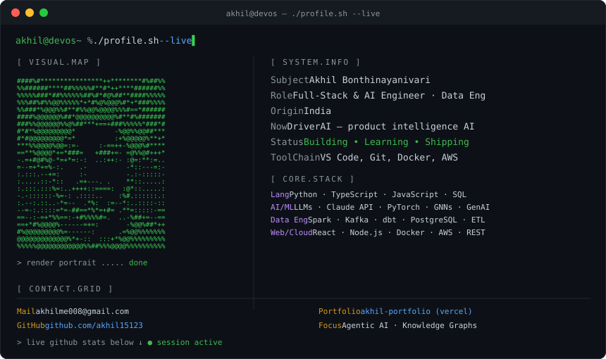

  

## Featured Projects

| Project | Description | Tech |
|--------|-------------|------|
| [signal-desk-agent](https://github.com/akhil15123/signal-desk-agent) | AI agent turning research prompts into intelligence briefs | TypeScript, LLMs |
| [drug-interaction-discovery](https://github.com/akhil15123/drug-interaction-discovery) | Drug-Drug Interaction prediction using GNN + Knowledge Graph + Claude LLM | Python, GNN |
| [relic-lab](https://github.com/akhil15123/relic-lab) | Generative AI app turning present-day problems into future artifact dossiers | JavaScript, GenAI |
| [case-pilot-legal-ai-prototype](https://github.com/akhil15123/case-pilot-legal-ai-prototype) | Plaintiff-side legal document intelligence | JavaScript, AI |
| [gen-ai](https://github.com/akhil15123/gen-ai) | Starter toolkit for GenAI: chat, streaming, tool loops | Python |
| [real_time_data_engineering-voting](https://github.com/akhil15123/real_time_data_engineering-voting) | Real-time data engineering with streaming pipelines | Python, Kafka |

---

## GitHub Stats

---

*If you find my work useful, consider giving a star!*
