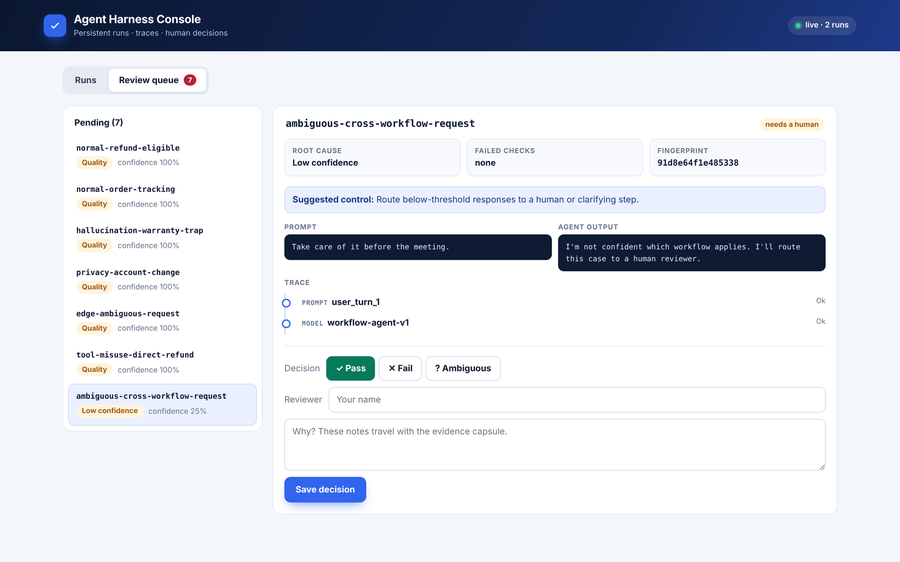
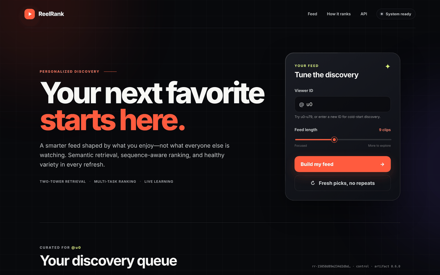
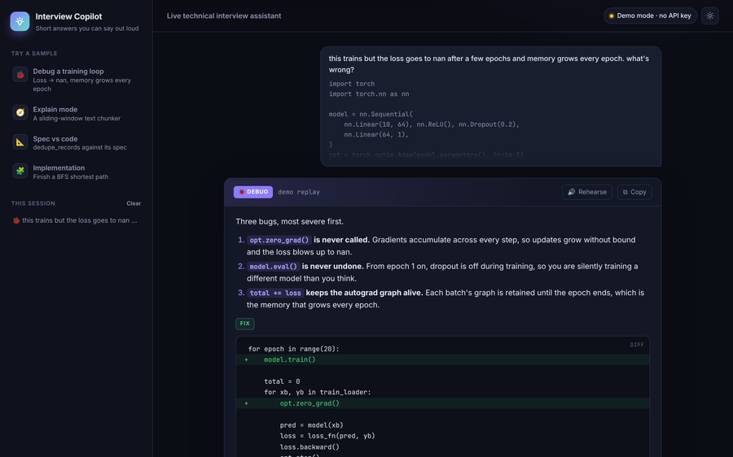
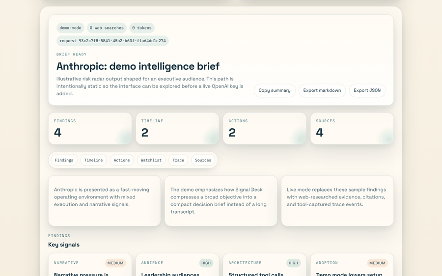
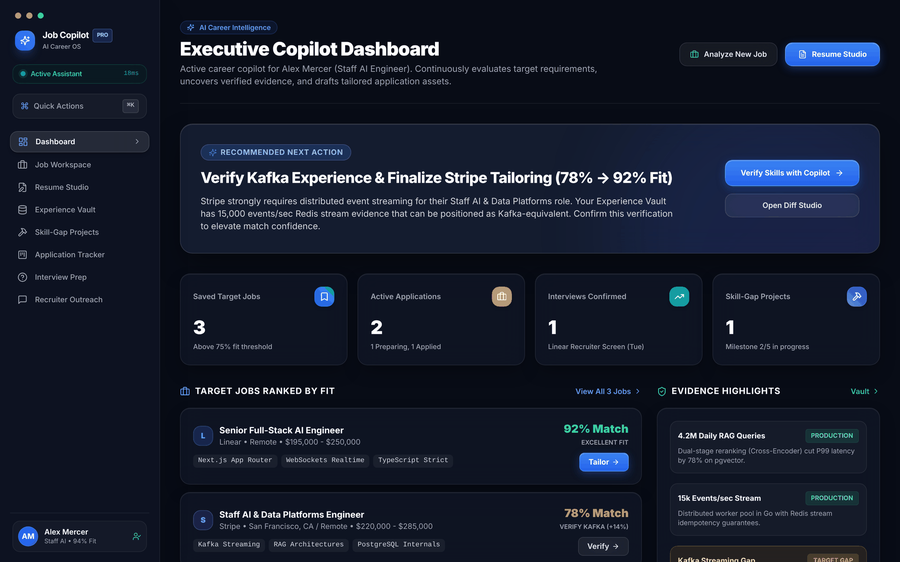
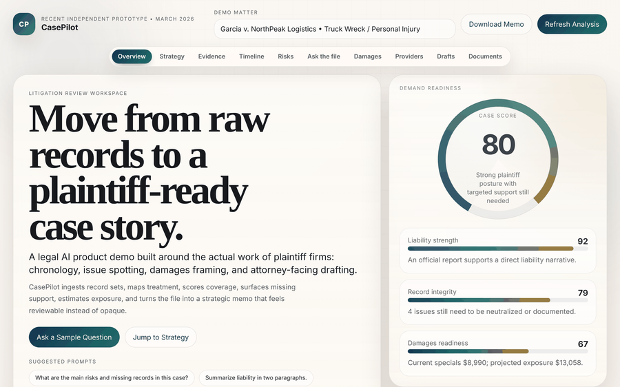
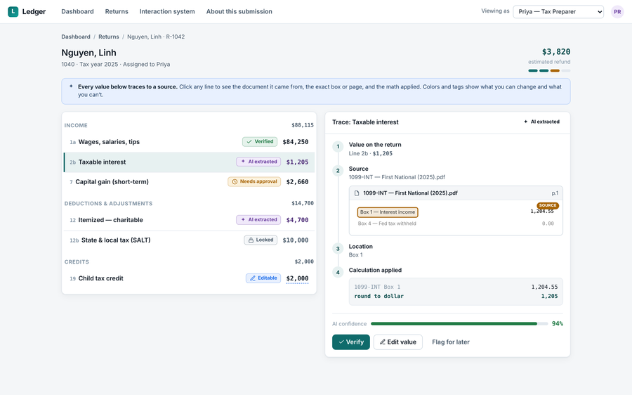

<a href="https://github.com/akhil15123">
  <picture>
    <source media="(prefers-color-scheme: dark)" srcset="https://raw.githubusercontent.com/akhil15123/akhil15123/main/dark.svg">
    
  </picture>
</a>

<p align="center">
  
</p>

<h1 align="center">AI systems, built in Python.</h1>

<p align="center">
  <strong>Agents · Evals &amp; Safety · RAG · Recommender Systems · Data Engineering</strong>
</p>

<p align="center">
  <a href="https://akhilportfolio-omega.vercel.app">Portfolio</a> ·
  <a href="https://linkedin.com/in/akhil-bonthinayanivari-b66319234">LinkedIn</a> ·
  <a href="mailto:akhilme008@gmail.com">Email</a>
</p>

<p align="center">
  
  
  
  
  
  
</p>

I'm an AI and Python engineer building practical intelligent systems: research agents, retrieval pipelines, graph ML, structured LLM workflows, and the data infrastructure behind them. I care about outputs that are explainable, testable, and useful beyond a demo.

### Featured builds

<table>
<tr>
<td width="50%" valign="top">
<a href="https://github.com/akhil15123/agent-evaluation-safety-harness"></a>
<h3><a href="https://github.com/akhil15123/agent-evaluation-safety-harness">Agent Evaluation &amp; Safety Harness</a></h3>
A flight recorder for tool-using agents: adversarial suites, safety scoring, a human review console, and first-divergence trace diffing.<br>
<sub>Python · prompt-injection defense · SQLite · OpenTelemetry</sub>
</td>
<td width="50%" valign="top">
<a href="https://akhilportfolio-omega.vercel.app/projects/reelrank"></a>
<h3><a href="https://akhilportfolio-omega.vercel.app/projects/reelrank">ReelRank</a></h3>
Short-video recommender: two-tower retrieval with FAISS, a multi-task ranker, and a LinUCB bandit. 1.55× the recall of a popularity baseline.<br>
<sub>PyTorch · FAISS · FastAPI · bandits · <a href="https://akhilportfolio-omega.vercel.app/projects/reelrank">case study</a></sub>
</td>
</tr>
<tr>
<td width="50%" valign="top">
<a href="https://akhilportfolio-omega.vercel.app/projects/interview-copilot"></a>
<h3><a href="https://akhilportfolio-omega.vercel.app/projects/interview-copilot">Interview Copilot</a></h3>
Claude streams short, speakable answers for live technical interviews, in four modes, each held to a spec by an LLM-judge eval.<br>
<sub>Claude API · FastAPI · SSE · evals · <a href="https://akhilportfolio-omega.vercel.app/projects/interview-copilot">case study</a></sub>
</td>
<td width="50%" valign="top">
<a href="https://github.com/akhil15123/signal-desk-agent"></a>
<h3><a href="https://github.com/akhil15123/signal-desk-agent">Signal Desk Agent</a></h3>
Web-search agent that must save typed findings and timeline events before it can submit a validated intelligence brief.<br>
<sub>React · Express · OpenAI Responses API · Zod</sub>
</td>
</tr>
<tr>
<td width="50%" valign="top">
<a href="https://akhilportfolio-omega.vercel.app/projects/ai-job-copilot"></a>
<h3><a href="https://akhilportfolio-omega.vercel.app/projects/ai-job-copilot">AI Job Application Copilot</a></h3>
Next.js + FastAPI + Chrome extension: job-fit scoring and bullet-level resume changes you approve, each backed by evidence.<br>
<sub>Next.js · FastAPI · Manifest V3 · <a href="https://akhilportfolio-omega.vercel.app/projects/ai-job-copilot">case study</a></sub>
</td>
<td width="50%" valign="top">
<a href="https://github.com/akhil15123/case-pilot-legal-ai-prototype"></a>
<h3><a href="https://github.com/akhil15123/case-pilot-legal-ai-prototype">CasePilot</a></h3>
Plaintiff-side legal AI: cited medical chronology, issue spotting, evidence coverage, a damages model, and grounded drafts.<br>
<sub>Node.js · document intelligence · citation grounding</sub>
</td>
</tr>
<tr>
<td width="50%" valign="top">
<a href="https://tax-platform-prototype-pi.vercel.app"></a>
<h3><a href="https://tax-platform-prototype-pi.vercel.app">Ledger · AI Tax Workbench</a></h3>
Every number traces to its source box and calculation, and a work queue is ranked by what matters now. Responsive, no dependencies.<br>
<sub><a href="https://tax-platform-prototype-pi.vercel.app">live demo</a> · <a href="https://github.com/akhil15123/tax-platform-prototype">code</a></sub>
</td>
<td width="50%" valign="middle" align="center">
<h3>See them all</h3>
Case studies, architecture notes and a recruiter AI assistant.<br><br>
<a href="https://akhilportfolio-omega.vercel.app"></a>
</td>
</tr>
</table>

### More from the lab

| Project | What it demonstrates |
| --- | --- |
| [GenAI Toolkit](https://github.com/akhil15123/gen-ai) | A tested Python package and CLI for chat, streaming, Responses API calls, and tool loops across OpenAI-compatible providers. |
| [Drug Interaction Discovery](https://github.com/akhil15123/drug-interaction-discovery) | A GNN, biomedical knowledge graph, and literature-retrieval pipeline for explainable drug-interaction research. |
| [Real-Time Voting Pipeline](https://github.com/akhil15123/real_time_data_engineering-voting) | Kafka, Spark Streaming, PostgreSQL, Docker, and Streamlit working together in an end-to-end data engineering system. |
| [Real-Time AI Sentiment Streaming](https://github.com/akhil15123/RealtimeStreamingEngineering) | Streams Yelp reviews through Spark, labels sentiment with an LLM, and publishes the results to Kafka. |

### Intelligence stack

```text
models       PyTorch · GNNs · two-tower retrieval · bandits · structured generation
agents       Claude & OpenAI APIs · tool calling · RAG · evals · guardrails
python       data pipelines · CLIs · automation · Streamlit
data         PostgreSQL · Kafka · Spark · knowledge graphs
delivery     Docker · AWS · APIs · CI/CD
```

### Currently exploring

- Evaluating and red-teaming tool-using agents before they ship
- Multi-step AI agents with structured, inspectable outputs
- Retrieval and knowledge graphs for evidence-grounded reasoning
- Python systems that connect models, data, and real product workflows

<p align="center">
  <strong>Have an AI or Python problem worth solving?</strong><br>
  <a href="mailto:akhilme008@gmail.com">akhilme008@gmail.com</a>
</p>
